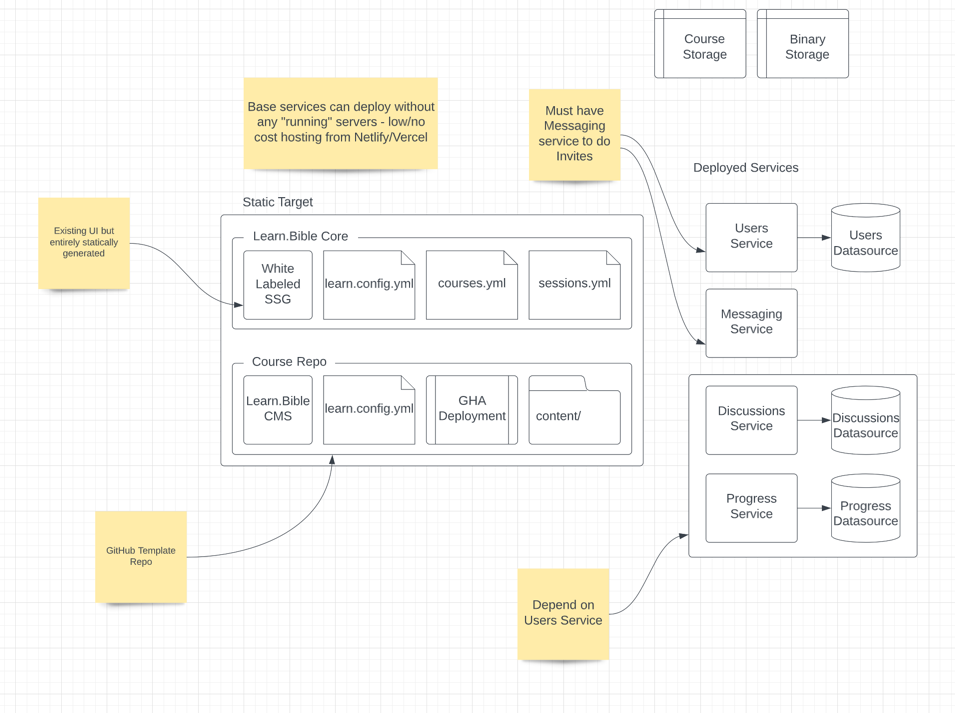

# Learn.Bible CMS

> A lightweight course authorship platform designed to making authoring Learn.Bible courses fast and painless.

## Principles

-   Lightweight
-   Single-Responsibility
-   Dev Optional

## Architecture

This project is built with the intention to ship it as a single binary and two static files as a GitHub repo template.

As such, this repo is only meant to be run locally, but never deployed as a deployed service.

The client is built with React for its relative ubiquity and to promote widespread participation in the project. The server is built in Go, primarily to make it easy to build a single binary and promote the principle of "Dev optional."

## Getting Started

## To Do's

-   [ ] Create a server that creates a file graph and serves the client
-   [ ] Create a client that can render based on the file graph
-   [ ] Design a build pipeline that can publish to a template repo
-   [ ] Ensure that the server can update in place

## Contributing
